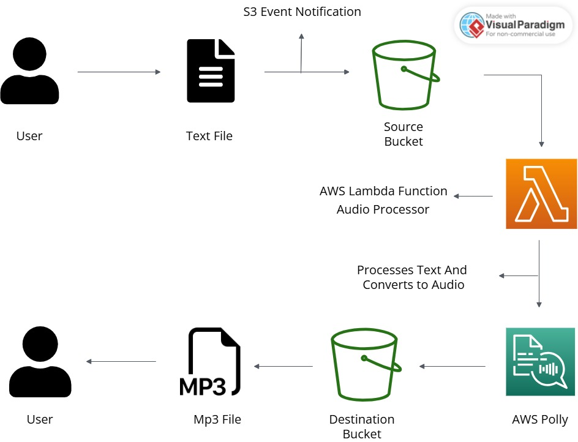

# AudioNarrator---Text-to-Speech-Converter
AudioNarrator is a project leveraging AWS services to convert text files (such as blogs, articles, or book excerpts) into high-quality speech. This tool uses Amazon Polly for text-to-speech synthesis, making written content accessible to a wider audience, including those who prefer listening over reading.

# Features:
1. Upload text files to an AWS S3 bucket.
2. Automatically converts text to speech using AWS Lambda and Amazon Polly.
3. Stores the generated audio files in a designated S3 bucket.
4. Supports both authenticated and unauthenticated user access (via Cognito).

# Project Architecture:

# Use Cases:
1. Accessibility: Provides audio versions of content for visually impaired users.
2. Learning: Enables listening to educational materials on the go.
3. Convenience: Allows users to multitask while consuming content.

# Tech Stack:
1. AWS S3: Storage for text and audio files.
2. AWS Lambda: Serverless text processing and Polly integration.
3. Amazon Polly: Text-to-Speech service.
4. AWS Cognito: Identity management for authenticated/unauthenticated access.
